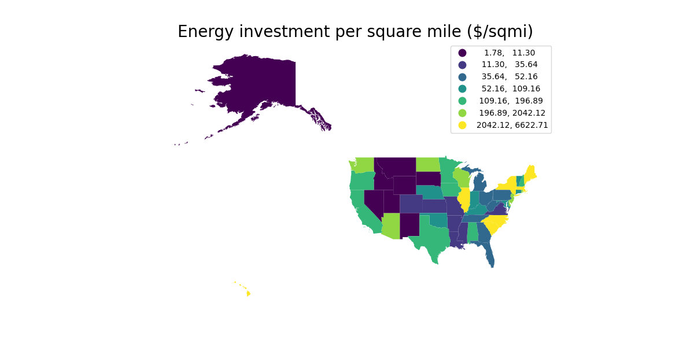
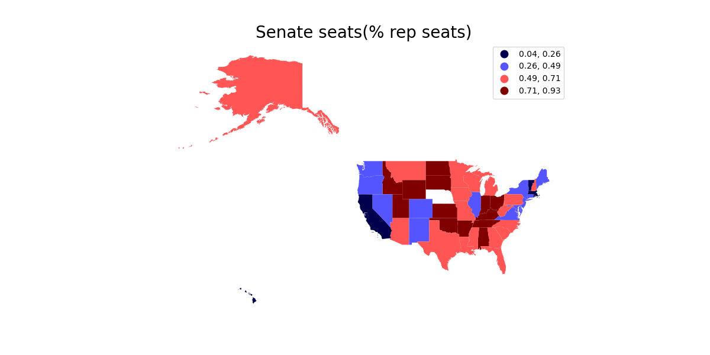
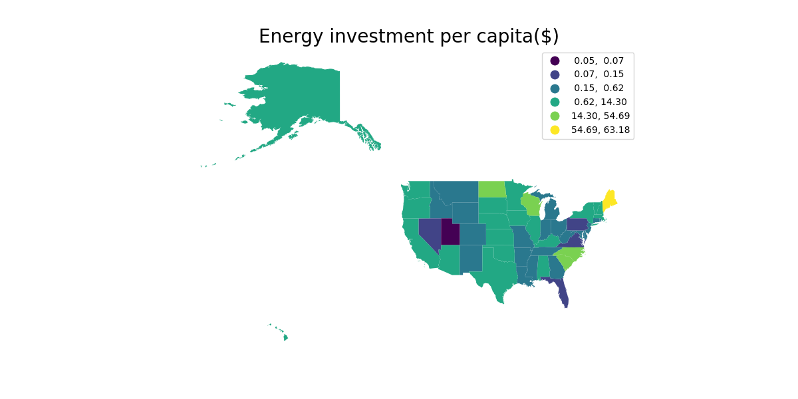

# State Partisanship and Energy Investment in the US
## Sustainability Analysis
12/04/2022

Jonathan Dysvik(jonathkd@stud.ntnu.no), Christoffer Røneid(chrirone@stud.ntnu.no)

Keywords:
* US Politics
* UN Sustainable Development goals:
    * 7: Affordable and clean energy
    * 11: Sustainable cities and communities

## Project overview
```
└───main
    │   env.yml
    │   README.md
    │
    ├───data
    │   ├───auxiliary
    │   │   └───auxiliary_state_pship
    │   │           State-Partisan-Composition-Table-June-2022.xlsx
    │   │
    │   ├───interim
    │   │   ├───interim_energy_inv
    │   │   │       energy_investment.csv
    │   │   │
    │   │   ├───interim_est_pop
    │   │   │       est_pop.csv
    │   │   │
    │   │   ├───interim_state_pship
    │   │   │       state_pship.csv
    │   │   │
    │   │   └───interim_us_map
    │   │           us_map.geojson
    │   │
    │   ├───processed
    │   │   └───processed_combined_data
    │   │           data.geojson
    │   │
    │   └───raw
    │       ├───dataset_provider_1
    │       │       State-Partisan-Composition-Table-June-2022.xlsx
    │       │
    │       ├───dataset_provider_2
    │       │       NST-EST2021-POP.xlsx
    │       │
    │       ├───dataset_provider_4
    │       │       USA_States_(Generalized).geojson
    │       │
    │       └───dateset_provider_3
    │               EnergyInvestments_DataDownloads.xlsx
    │
    ├───docs
    │   │   TEP4221 Presentasjon.pptx
    │   │
    │   └───references
    ├───src
    │   │   05_combine_data.py
    │   │   06_visualization.py
    │   │
    │   ├───energy_investment
    │   │       01_clean_data_energy_investment.py
    │   │
    │   ├───map
    │   │       02_clean_map_data.py
    │   │
    │   ├───pop
    │   │       03_clean_data_est_pop.py
    │   │
    │   └───state_partisan
    │           04_clean_state_partisan.py
    │
    └───visualisations
            plot_eninv_area.png
            plot_eninv_percap.png
            plot_percent_rep.png
```

## Introduction
According to Pew Research, studies show that Democrats are more than [three times as likely](https://www.pewresearch.org/fact-tank/2020/02/28/more-americans-see-climate-change-as-a-priority-but-democrats-are-much-more-concerned-than-republicans/) to say that climate change should be a top priority. This goes along with the general consensus of more climate awareness on the left in the USA, with strong democrat candidates like Al Gore being avid climate change activists. In this project, we are examining state partisanship and energy investment in the USA to answer the following research question.

### Research question
> What is the relation between state partisanship and the corresponding state's energy investment?
 
## Datasets

* Population estimates of the United states as of July 1 2021. from the United States Census Bereu
    * Used to examine investments per capita 
* The US Departments of Agriculture's data of energy investment of each state
    * Examine the individual investments of each state
    * We have filtered to the year 2021 to possibly get a better view of the effect of the election
* Cartographic boundaries of the States from United Nations Covid-19 response statshub based on data from the Census bereau
    * For plotting the combined data on a map for an easier veiwing experience
* Auxillary
    * The current state & legislative partisanship in the USA from the National Conference of State Legislatures

## Challenges
* Auxilliary files
    * Due to the state partisanship file being in PDF format, we had to manually type the data in to excel
* Visualization
    * Showing the data in a readable and understandable manner, huge gaps between the states in terms of investments. Resulting in plotting and visualizing becoming hard, but we tricked around and found the schemes that fit best
    * Making the comparison between state partisanship and investment easy to follow, plotting them together was messy so we have included them side by side for comparison
* Nonpartisan states
    * More states are moving away from the two-party system (thankfully), so "nonpartisan" votes are more common. This affect mainly Nevada where they make up the bulk of voters, causing i to be a [nonpartisan state](https://thenevadaindependent.com/article/nonpartisan-power)

## Visualisations



*Energy investment per square mile, state partisanship below for reference*

*Percentage of republican seats in senate, Nevada are nonpartisan*
<br>
<br>
*------------------------*
<br>
<br>

*Energy investment per capita, state partisanship below for reference*

*Percentage of republican seats in senate, Nevada are nonpartisan*

## Conclusion
We see som patterns when comparing the data. Especially the very democratic states in the north west such as Maine, Vermont, Massachusetts, New York and Connecticut. Where they perform great in both investments per capita and per square mile. We see the same pattern for the democratic states on the west coast such as California, Oregon and Washington.

As visualized by the data, the deep republican mid-west states are some of the worst performing in both categories. Specifically Idaho, Wyoming, Utah and Montana. As well as southern republican states Mississippi, Louisiana and Arkansas.

In our opinion, though the data shows patterns, doesnt justify drawing a cut and dry relation between the partisanship and investment. We can find multiple examples of democrat states performing poorly and vice versa. Though it does create an interesting image to see how politics affects the climate, but the partisanship and investment may possibly also be linked to other factors such as gdp per capita and rate of higher education in the aforementioned states.
### References

* [US Cartography UNstats](https://covid-19-data.unstatshub.org/maps/99fd67933e754a1181cc755146be21ca)
* [Cartographics census bureau](https://www.census.gov/geographies/mapping-files/time-series/geo/carto-boundary-file.html)
* [Energy investment in the USA](https://www.wctsservices.usda.gov/energy/maps/investment)
* [Population estimate USA](https://www.census.gov/data/tables/time-series/demo/popest/2020s-state-total.html#par_textimage_1574439295)
* [State Partisanship USA](https://www.ncsl.org/research/about-state-legislatures/partisan-composition.aspx)
* [Pew research](https://www.pewresearch.org/fact-tank/2020/02/28/more-americans-see-climate-change-as-a-priority-but-democrats-are-much-more-concerned-than-republicans/) 
* [Nevada independant](https://thenevadaindependent.com/article/nonpartisan-power)

